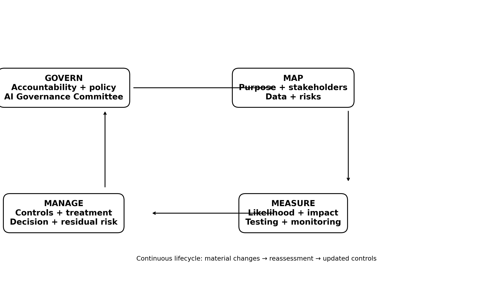
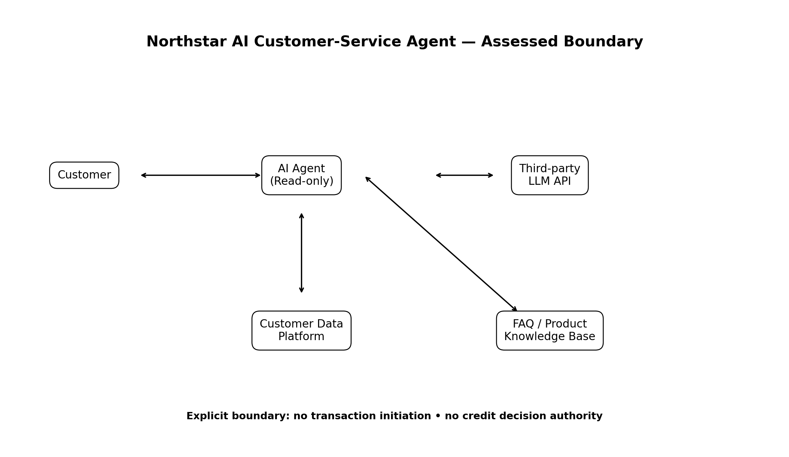

# NIST AI RMF Risk Assessment — Enterprise AI Customer-Service Agent

**Portfolio Project 2 of 5 | AI Governance, AI Risk & Responsible AI**

This project applies the **NIST AI Risk Management Framework (AI RMF 1.0)** to a hypothetical AI-powered customer-service agent used by a fictional Indian NBFC, Northstar FinTech Services Pvt. Ltd.

The assessment is designed as a practical governance exercise rather than a technical model-development project. It demonstrates how an AI governance professional can move from use-case context and risk identification to measurement, control design, residual-risk treatment, and a documented deployment decision.

## Use case

The fictional agent:
- answers customer-service questions;
- retrieves read-only account information;
- uses a third-party LLM API;
- accesses a product/FAQ knowledge base and session conversation history;
- has **no transaction-initiation authority**.

The scope restriction is intentionally treated as a risk control.

## What this repository demonstrates

| Capability | Repository artifact |
|---|---|
| AI risk framing | [02_Framework_Mapping/govern_map_measure_manage.md](02_Framework_Mapping/govern_map_measure_manage.md) |
| Risk identification and prioritization | [03_Risk_Register/risk_register.xlsx](03_Risk_Register/risk_register.xlsx) |
| Governance accountability | [04_Governance/governance_structure.md](04_Governance/governance_structure.md) |
| Deployment decision | [04_Governance/governance_decision.md](04_Governance/governance_decision.md) |
| Control design | [05_Controls/control_matrix.md](05_Controls/control_matrix.md) |
| System/control architecture | [06_Diagrams/ai_governance_control_flow.png](06_Diagrams/ai_governance_control_flow.png) |
| Evidence trail | [01_Research/research_log.md](01_Research/research_log.md) and [08_References/sources.md](09_References/sources.md) |
| Final assessment | [08_Final/NIST_AI_RMF_Assessment_Final.pdf](08_Final/NIST_AI_RMF_Assessment_Final.pdf) |
## Important scope note

Northstar is fictional. The risk ratings, governance bodies, incidents, policies, and internal operating assumptions are illustrative and are not claims about a real organization.

The assessment also separates **NIST AI RMF risk management** from **legal/regulatory compliance**. The final PDF explicitly states that the exercise does not constitute legal advice or a compliance certification.

## Framework basis

NIST AI RMF 1.0 organizes AI risk management around four functions:

**Govern → Map → Measure → Manage**

Govern is cross-cutting and informs the other three functions. This repository therefore treats the functions as an operating cycle rather than a one-time checklist.

## Governance control flow

## How to review this project

1. Start with this README.
2. Read `02_Framework_Mapping/govern_map_measure_manage.md`.
3. Open `03_Risk_Register/risk_register.xlsx`.
4. Review the governance decision and control matrix.
5. Use the diagram to understand how the artifacts connect.
6. Read the final PDF for the complete assessment narrative.

## Limitations

This is a portfolio case study. Qualitative likelihood/impact ratings are reasoned judgments for the exercise, not empirical incident statistics. They should be recalibrated against real monitoring data in an actual deployment.

---
*[← Back to full AI Governance portfolio](https://github.com/Nisarga0104)*
